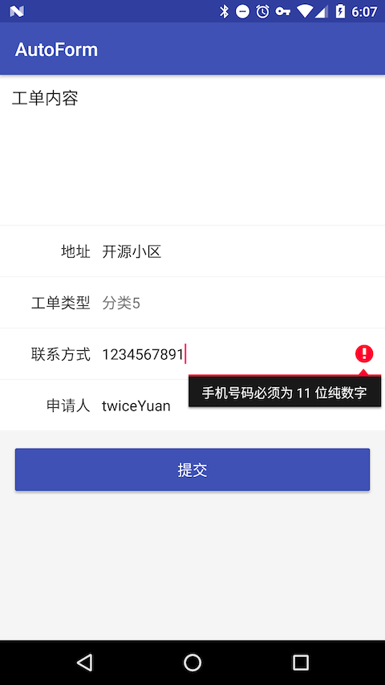
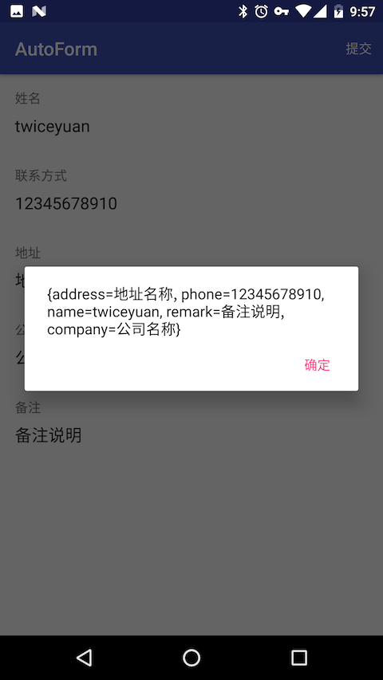

# AutoForm

Android 表单页面逻辑生成管理工具

# 使用方式

1. 定义一个表单类 `DemoForm.java`，用来说明表单里的输入项、样式、提示（TODO：校验器）

    ```java
    @Form
    public class DemoForm {

        @FormField(label = "姓名", order = 0)
        public String name;

        @FormField(label = "联系方式", order = 1)
        public String phone;

        @FormField(label = "地址", order = 2)
        public String address;

        @FormField(label = "公司", order = 3)
        public String company;

        @FormField(label = "备注", order = 4)
        public String remark;
    }
    ```

2. 用 `FormManager.build(DemoForm.class)` 来获取 manager 对象，然后通过 manager 获取 RecyclerView 的适配器并设置给 RecyclerView：
    ```java
    mFormManager = FormManager.build(DemoForm.class);
    mRecyclerView.setLayoutManager(new LinearLayoutManager(this));
    mRecyclerView.setAdapter(mFormManager.getAdapter());
    ```
    
3. 获取输入结果：
    ```java
    mFormManager.getResult() // 返回 Map<String, Object> 对象
    ```

4. 大多数情况需要定制表单样式。如果需要整个表单使用统一样式，可以在 @Form 注解中标注 itemProvider 的值为一个 FormItemProvider 子类的 Class。

   然后通过继承 FormItemProvider 来实现样式定制。还有一些其他的属性也提供了类似的定制方式，例如编辑框的 hint 提示等，使用方式可以参考默认值 SimpleFormItemProvider 和 SimpleHintProvider 的代码。

   因为注解的 Field 在反射获取时是顺序无关的，所以需要 order 类来标注顺序，这个暂时还没有找到更好的方案。

## 效果示意

1. 默认生成的输入界面
 


2. 获取输入结果

